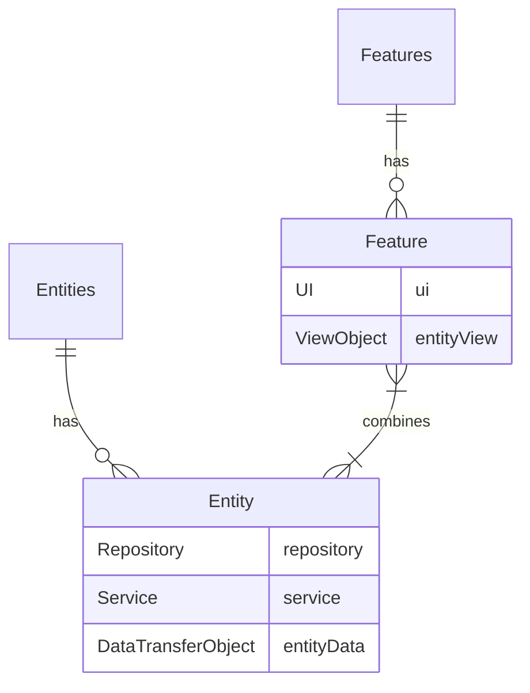

# DDD + Feature Sliced Design にトライ

## TODO

- [ ] CQRS 導入
- [ ] ValueObject 導入
  - Mutation 実装時に一緒にやることになるのではと思っている
- [ ] DI Container
  - そもそも React フレンドリーな DI コンテナがあるのか？

## Directory

```mermaid
erDiagram
    Entities ||--o{ Entity : has
    Entity {
        Repository repository
        Service service
        DataTransferObject entityData
    }

    Features ||--o{ Feature : has
    Feature {
        UI ui
        ViewObject entityView
    }

    Feature }|--|{ Entity : combines

```
